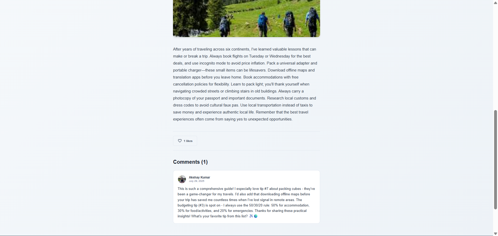

# 🏠 StaySpot - Vacation Rental Platform
## 📸 Website Screenshots

Here are some screenshots showcasing the StaySpot platform:

### 🏠 Modern Homepage


### 🏷️ Property Listings & Categories


### 📄 Listing Details Overview


### 📄 Listing Details - Gallery & Info


### ➕ Create a New Listing - Step 1


### ➕ Create a New Listing - Step 2


### 📝 Explore Travel Blogs


### 📚 Browse Travel Blog Stories


### 📖 Featured Story 1


### � Featured Story 2


### 📖 Featured Story 3


### ✍️ Write Your Own Travel Story


### 👤 My Personal Story Collection

- **Rich Content**: Support for images and formatted text
- **Category System**: Blogs organized by travel categories
- **User Stories**: Personal blog management

### 💝 Wishlist & Trips
- **Wishlist**: Save favorite properties for later
- **Trip Planning**: Organize upcoming trips
- **Booking Management**: Track reservations and bookings

## 🛠️ Tech Stack

### Frontend
- **React 18**: Modern React with hooks
- **Redux**: State management
- **SCSS**: Advanced styling with variables
- **Material-UI**: Component library
- **React Router**: Navigation
- **React Icons**: Icon library

### Backend
- **Node.js**: Server runtime
- **Express.js**: Web framework
- **MongoDB**: Database with Mongoose ODM
- **JWT**: Authentication
- **Multer**: File upload handling
- **Bcrypt**: Password hashing

### Deployment
- **Render**: Cloud hosting platform
- **MongoDB Atlas**: Cloud database
- **Environment Variables**: Secure configuration

## 🚀 Quick Start

### Prerequisites
- Node.js (v16 or higher)
- MongoDB (local or Atlas)
- Git

### Installation

1. **Clone the repository**
   ```bash
   git clone https://github.com/yourusername/stayspot.git
   cd stayspot
   ```

2. **Install dependencies**
   ```bash
   # Install backend dependencies
   cd server
   npm install

   # Install frontend dependencies
   cd ../client
   npm install
   ```

3. **Environment Setup**
   
   Create `.env` file in `server/` directory:
   ```env
   PORT=3001
   MONGODB_URI=mongodb://localhost:27017/stayspot
   JWT_SECRET=your_jwt_secret_here
   ```

   Create `.env` file in `client/` directory:
   ```env
   REACT_APP_API_URL=http://localhost:3001
   ```

4. **Start the application**
   ```bash
   # Start backend (from server directory)
   npm start

   # Start frontend (from client directory)
   npm start
   ```

5. **Access the application**
   - Frontend: http://localhost:3000
   - Backend: http://localhost:3001

## 📁 Project Structure

```
stayspot/
├── client/                 # React Frontend
│   ├── public/            # Static assets
│   │   └── assets/        # Images and icons
│   ├── src/
│   │   ├── components/    # Reusable components
│   │   ├── pages/         # Page components
│   │   ├── redux/         # State management
│   │   ├── styles/        # SCSS stylesheets
│   │   └── utils/         # Utility functions
│   └── package.json
├── server/                # Node.js Backend
│   ├── models/            # MongoDB schemas
│   ├── routes/            # API endpoints
│   ├── middleware/        # Custom middleware
│   ├── public/uploads/    # User uploaded files
│   └── package.json
├── .gitignore
├── DEPLOYMENT.md
└── README.md
```

## 🔧 Key Features Implementation

### Category Navigation System
- **Categories Component**: Visual category browsing below hero section
- **Filter System**: Icon-based filtering within listings
- **Navigation**: Separate category pages with dedicated routing
- **Icons**: React Icons integration for visual appeal

### Responsive Design
- **Mobile-First**: Optimized for all screen sizes
- **Flexbox Layout**: Modern CSS layout techniques
- **SCSS Variables**: Consistent theming and colors
- **Breakpoints**: Responsive design with custom breakpoints

### Security Features
- **JWT Authentication**: Secure token-based authentication
- **Password Hashing**: Bcrypt for password security
- **Input Validation**: Server-side validation for all inputs
- **File Upload Security**: Secure image upload handling

## 🎨 UI/UX Highlights

### Design System
- **Color Palette**: Consistent color scheme with SCSS variables
- **Typography**: Nunito font family throughout
- **Icons**: React Icons for consistent iconography
- **Animations**: Smooth hover effects and transitions

### User Experience
- **Intuitive Navigation**: Clear category and filter systems
- **Visual Feedback**: Loading states and success messages
- **Responsive Images**: Optimized image loading and display
- **Accessibility**: Proper alt texts and semantic HTML

## 🔒 Security Considerations

- **Environment Variables**: All sensitive data in environment variables
- **JWT Tokens**: Secure authentication with proper token management
- **Input Sanitization**: Server-side validation for all user inputs
- **File Upload Security**: Type and size validation for uploads
- **CORS Configuration**: Proper cross-origin resource sharing

## 🚀 Deployment

See [DEPLOYMENT.md](./DEPLOYMENT.md) for detailed deployment instructions to Render.

### Environment Variables for Production

**Backend:**
```env
MONGODB_URI=your_mongodb_atlas_connection_string
JWT_SECRET=your_secure_jwt_secret
PORT=3001
NODE_ENV=production
```

**Frontend:**
```env
REACT_APP_API_URL=https://your-backend-domain.onrender.com
GENERATE_SOURCEMAP=false
```

## 🤝 Contributing

1. Fork the repository
2. Create a feature branch (`git checkout -b feature/amazing-feature`)
3. Commit your changes (`git commit -m 'Add amazing feature'`)
4. Push to the branch (`git push origin feature/amazing-feature`)
5. Open a Pull Request

## 📝 License

This project is licensed under the MIT License - see the [LICENSE](LICENSE) file for details.

## 🙏 Acknowledgments

- **React Team**: For the amazing framework
- **Material-UI**: For the component library
- **MongoDB**: For the database solution
- **Render**: For the hosting platform

## 📞 Support

If you have any questions or need help:
1. Check the [DEPLOYMENT.md](./DEPLOYMENT.md) for deployment issues
2. Review the code comments for implementation details
3. Open an issue for bugs or feature requests

---

**StaySpot** - Where every stay tells a story! 🏠✨ 